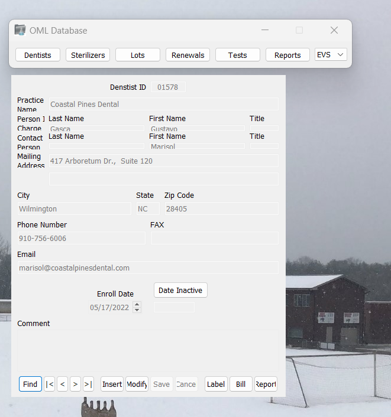
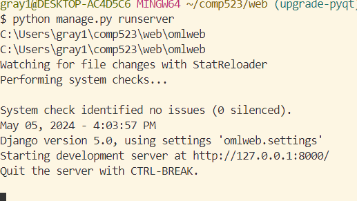

# OMLSMS v2

> Oral Microbiology Lab's Sterilization Monitoring Service (OMLSMS) is used to monitor the functioning of dental sterilizers in offices across the region.

## Description

The original OMLSMS application was developed as part of a class capstone project at UNC Chapel Hill in 2014. At the time, it was coded in Python 2.7 and used PyQt4 as the GUI framework. Django was used for the database abstraction layer and template language. Django-mssql permitted the use of a SQL Server with Django. XHTML2PDF was used to convert HTML files into PDF files.

This project is focused on rewritting OMLSMS and updating all of its imports to the latest stable versions. Python 3 will be used along with PyQt5. The goal is to make the application more stable and up-to-date with current technologies along with implementing some changes requested by the clients.

## Programming Languages and Frameworks

1. Install and ensure you are running Python 3 in the 64-bit architecture.
2. Install (or upgrade) pip by running the following:
    ```
    python -m ensurepip --upgrade
    ```
3. Now pip can be used to install dependencies. Install PyQt5 by running: 
    ```
    pip install PyQt5
    ```

4. Install pywin32 by running:
    ```
    pip install pywin32
    ```
    
5. Install Django by running: 
    ```
    pip install Django
    ```
    Ensure that the version installed is 5.0.
   
6. Install mssql-django by running: 
    ```
    pip install mssql-django
    ```
   Ensure that the version installed is 1.5.

7. Install Reportlab by running the following:
    ```
    pip install Reportlab
    ```
    Ensure that the version installed is 2.7.

8. Install xhtml2pdf by running (this may need to be done after installing Reportlab):
   ```
    pip install xhtml2pdf
    ```
   Ensure that the version installed is 1.5.

9. Install ghostscript by running the following:
    ```
    pip install ghostscript
    ```

10. Install ODBC Driver 17 at https://learn.microsoft.com/en-us/sql/connect/odbc/download-odbc-driver-for-sql-server?view=sql-server-ver16.

## Application Setup

To begin, you will need to download both Microsoft Server SQL 2022 and Microsoft SQL Server Management Studio. and create an Microsoft SQL server instance. To be clear this application is supposed to run with Microsoft Server SQL 2019, but we could not find where to download this version so we just made sure that our connection method was compatible with Microsoft SQL Server 2019. We found that [this video](https://www.youtube.com/watch?v=835Zubb1vuU) was helpful in doing this process. The video is part 1 of a multiple part series, but the only parts you should need to watch are part 1 and part 2. This should cover correctly setting up a Microsoft Server instance and how to restore a database from a backup file, which is probably what you will be doing. After you have completed these steps you will need to make a user for your database. You should create a query and write:

```sql
CREATE LOGIN [login name] WITH PASSWORD = [password]

USE omlsms
CREATE USER [login name] FOR LOGIN [login name]
```

This should create a user in your server instance. We recommend making this something that is easy to remember because it is hard to find your password for a user after creation. After doing this, you will need to right click on omlsms -> Properties -> Permissions -> Click the user you just created and then apply all of the permissions listed. You will need to do this from a user who is a server admin for your server instance. After these steps have been completed, you should be ready to try to test connecting to the database. 
    
## Database Connection

This is by far what our team found to be the most challenging aspect of the semester, so don't be frustrated if this proves to be frustrating for you as well. We recommend doing these steps (including the ones above) together to ensure that you all can connect to the database, which will make improving the database easier, since everyone will have access to the application. You can test this in two ways:

1. Connecting via the application (recommended since you will have to do this anyways)
    To do this, you will need to navigate to the db_rewrite directory and run 
    ```
    python omldb.py 
    ```
    in a terminal. The starting file (omldb.py) will bring up a login dialog box (logindlg.py). You will need to edit the lines in the dialog box file setting up the user and password to reflect that of what you created above. If you don't recieve an error and see the picture below, then you have successfully connected to the database and can access the application. This can take some time because of what the code is doing to set up the application so be wary of that.
    
2. Connecting via the Django part of the project (still helpful because django is used to connect to the database)
    To do this you will need to navigate to the web directory and run
    ```
    python manage.py runserver
    ```
    in a terminal. The database template in `settings.py` should work, but you will need to change the "HOST:" to your specific SQL instance and add "USER" and "PASSWORD" keys to the dictionary given to the DATABASES constant. Currently, it is set up to operate in windows authorization mode, but you can add your user and password to make it work for SQL server authorization mode as well. When you run the command, you should not see any major errors, that will mean that you have connected to the database successfully. 
        
## Using the Application

Once you have gotten past the login dialog box, you will see a screen as such that is linked below. You should be able to click among the tabs. Our group was able to fix most of the bugs with running the application like normal, but were unable to get to some bugs as well. These bugs are mainly in the report dialog and relate to viewing/printing reports. We also think that there might be bugs in other dialog boxes in the application that are more feature specific. The list mainly goes:

1. View/Printing reports in the Reports section
2. Other small bugs related to buttons in other parts of the application (we think)
3. Work will also needed to be done by including the correct installation files/updating the current instructions

These should be your next steps before trying to implement new features in the application. 

If you run into errors at any point in this process, the internet and Dr. Reisdorf will be your best friend. One last thing that might be helpful is asking for videos of what the expected usage/output of the database features are supposed to look like. Best of Luck!

## Authors

### Original Authors

- [Maik Ruckauf](https://github.com/MaikRuckauf)

- [Kemani Simms](https://github.com/Kasmanian)

### Current Authors

- [Matthew Reddy](https://github.com/matthewreddy)

- [Grayson Clark](https://github.com/graysonjclark1)

- [Connor Morin](https://github.com/connor2702)

- [Jason Manning](https://github.com/jasonmanning27)

## Pictures

Application:



Successful Django connection:



